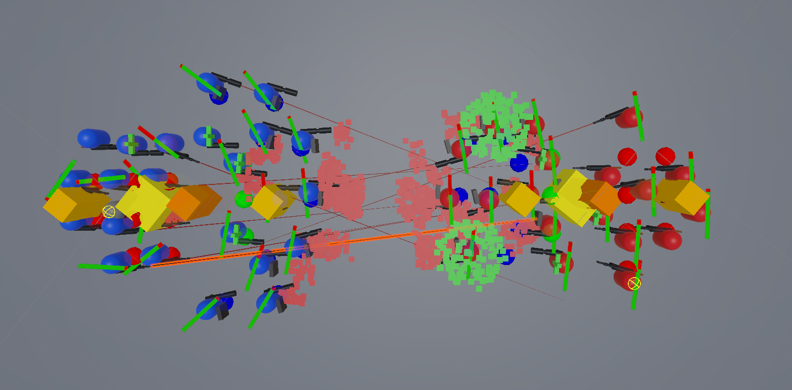

<h2> Projet Squad IA  </h2>

<h3>🛠️ Outils</h3>

- VisualStudio 2022, Unity 6

<h3>⌨️ Langage</h3>

- C#

<h3>🎮 Plateforme</h3>

- PC

<h3>ℹ️ À propos</h3>
Ce jeu a été réalisé par une équipe de deux game programmers sur une durée de 3 semaines.

Le but du projet était de se familiariser avec différentes techniques d’implémentation d’intelligences artificielles.

Vous trouverez dans ce projet un SquadDirector piloté par une FSM, chargé de gérer les déplacements des troupes, ainsi qu’un State Tree dédié aux comportements individuels des membres de l’escouade.
  
  <h4>Lors de ce projet, j'ai implémenté :</h4>
    <ul> 
        <li>une FSM qui contrôle les mouvements d'une escuade.</li>
        <li>algorithme pour la mise en formation.</li>
        <li>les mouvements du joueur.</li> 
        <li>rédaction de documentation sur la technique implémentée.</li> 
    </ul>

Pour parler un peu plus de la mise en formation : lorsqu’une équipe fait face à une autre, je calcule leur position moyenne afin d’obtenir une direction de référence.

À partir de cette direction et grâce à plusieurs paramètres, je place les unités défensives en arc de cercle sur la ligne de front, avec un certain décalage par rapport à la position moyenne de base.

Je positionne ensuite les healers à une distance définie du défenseur le plus proche, puis les attaquants à une certaine distance des healers.

Avec un bon paramétrage, les escouades se ruent l’une sur l’autre jusqu’à atteindre une distance prédéfinie. Ensuite, lorsque la front line commence à faiblir, l’escouade recule naturellement : la position moyenne de l’équipe se déplace vers l’arrière, ce qui simule de manière convaincante une fuite ou une retraite.

Sur l’image ci-dessus :
- le plus gros cube jaune représente la position moyenne de l’équipe ;
- le cube le plus fin correspond à la position du défenseur le plus proche, aligné avec la direction de référence ;
- le même principe est ensuite appliqué aux healers et aux attaquants.

<h3>👾 À propos du jeu</h3>
Le joueur apparaît avec une équipe d’ia et peut se déplacer dans la carte pour rencontrer
des groupes d’ia agressifs.

Input :
- ZQSD/WASD : déplacement
- Clique Gauche : tire du joueur
- Clique Droit : demande de cover du joueur
- Tab : ouvre le menu

## Documentation
- [Rapport complet](DocumentationAISquad.pdf)