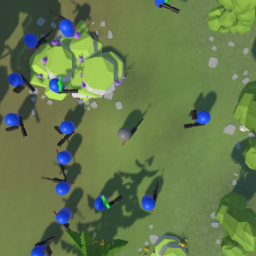
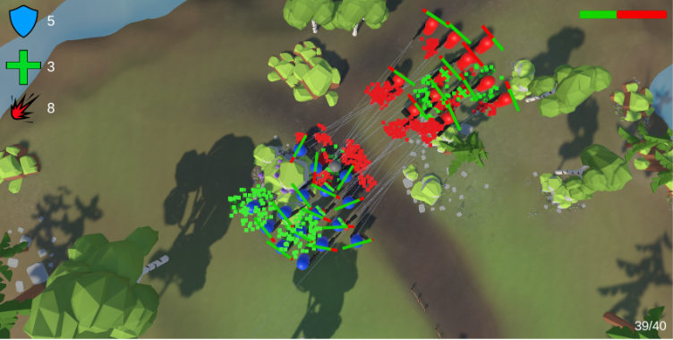

<h2> Projet Squad IA  </h2>

<h3>🛠️ Outils</h3>

- VisualStudio 2022, Unity 6

<h3>⌨️ Langage</h3>

- C#

<h3>🎮 Plateforme</h3>

- PC

<h3>ℹ️ À propos</h3>
Ce jeu a été réalisé par une équipe de deux game programmers sur une durée de 3 semaines.

Le but du projet était de se familiariser avec différentes techniques d’implémentation d’intelligences artificielles.

Vous trouverez dans ce projet un SquadDirector piloté par une FSM, chargé de gérer les déplacements des troupes, ainsi qu’un State Tree dédié aux comportements individuels des membres de l’escouade.
  
  <h4>Lors de ce projet, j'ai implémenté :</h4>
    <ul> 
        <li>une FSM qui contrôle les mouvements d'une escuade.</li>
        <li>les mouvements du joueur.</li> 
        <li>rédaction de documentation sur la technique implémentée.</li> 
    </ul>

<h3>👾 À propos du jeu</h3>
Le joueur apparaît avec une équipe d’ia et peut se déplacer dans la carte pour rencontrer
des groupes d’ia agressifs.

Input :
- ZQSD/WASD : déplacement
- Clique Gauche : tire du joueur
- Clique Droit : demande de cover du joueur
- Tab : ouvre le menu

## Documentation
- [Rapport complet](DocumentationAISquad.pdf)